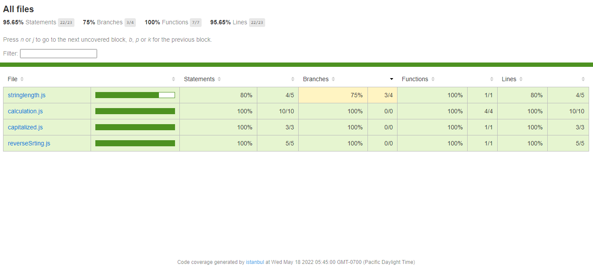

# Code-testing-Practice

## Built With

- Jest
- JavaScript 

## Coverage

### Install

Clone the repository
https://github.com/Richez003/Code-testing-Practice
npm . init -y
npm install

## Run tests

npx stylelint "\*_/_.{css,scss}"
npx hint .
npx eslint .

- Web Browser
- [Visual Studio code](https://code.visualstudio.com/)

## Authors

👤 ## Author

👤 **Richard Friday**

- GitHub: [@Richez003](https://github.com/Richez003)
- Twitter: [@richardfriday14](https://twitter.com/richardfriday14)
- LinkedIn: [@LinkedIn](https://www.linkedin.com/in/richard-friday-54980718a)
- 
## 🤝 Contributing

Contributions, issues, and feature requests are welcome!

Feel free to check the [issues page](https://github.com/Richez003/Code-testing-Practice/issues).

## Show your support

Give a ⭐️ if you like this project!

## 📝 License

This project is [MIT](./MIT.md) licensed.
